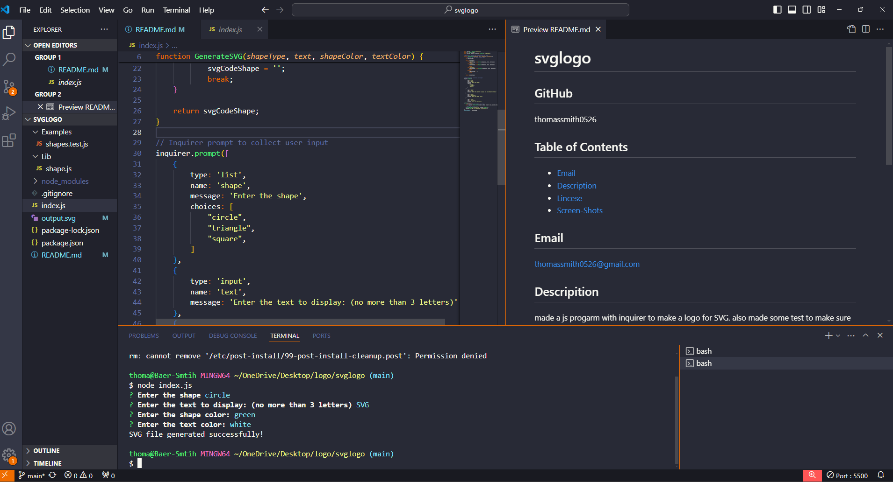
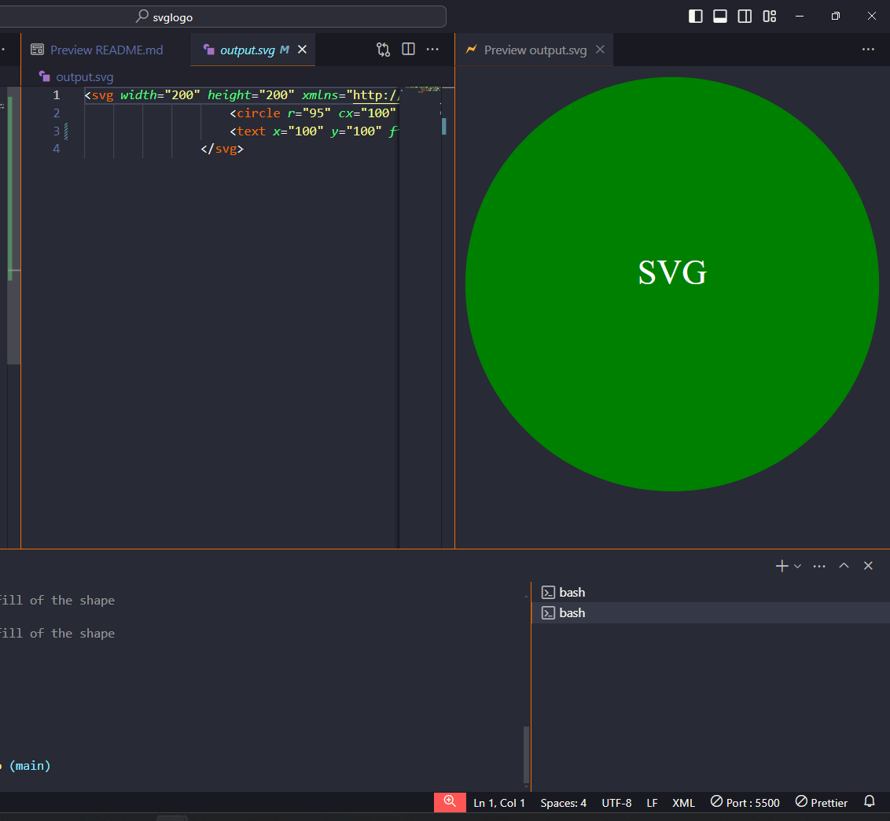
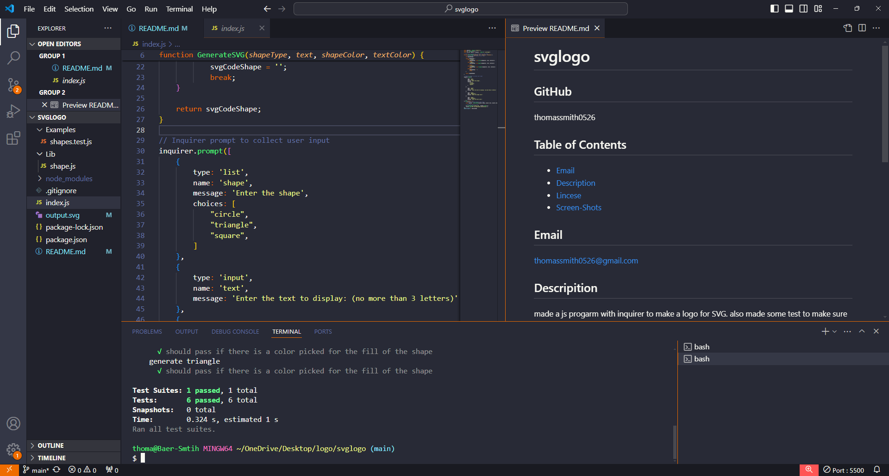

# SVG Logo
## GitHub
thomassmith0526
## Table of Contents
* [Email](#Email)
* [Description](#Description)
* [Lincese](#Lincese)
* [Screen-Shots](#Screen-Shots)
## Email
thomassmith0526@gmail.com
## Descripition
made a js progarm with inquirer to make a logo for SVG.
also made some test to make sure that SVG would get the correct logo.
## Lincese
N/A
## Screen Shots 

## Question
If you have any question please feel free to reach out to me at thomassmith0526@gmail.com